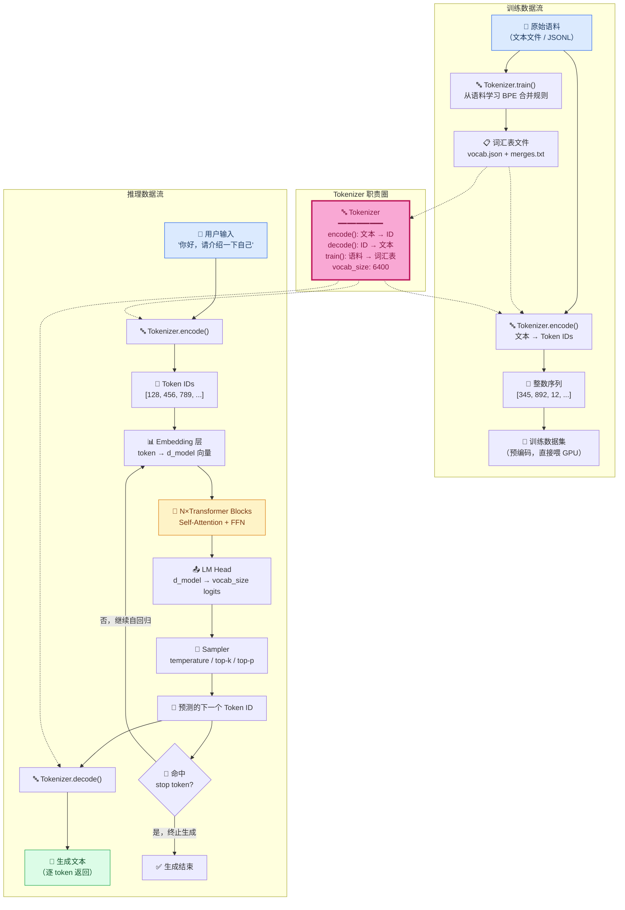

# Tokenizer

> **Source Reference:** Tokenizer metadata (version definitions, feature matrices,
> pipeline stage descriptions) is maintained in `src/data/minimind/tokenizer-registry.ts`.
> This file is the canonical source; all consumers derive their data from it.

## Purpose

Tokenizer 是语言模型的第一道关口——将原始文本转换为模型可以理解的数字序列（token IDs）。理解 Tokenizer 是理解整个 LLM 管道的起点：模型从未"看见"过文字，它只看见 token。

MiniMind 使用 BPE（Byte-Pair Encoding）分词算法，通过统计字符对的共现频率来构建子词词汇表，在词汇表大小与编码效率之间取得平衡。

## Input

- 原始文本语料（训练语料或推理输入）
- 预训练的词汇表文件（`vocab.json` / `merges.txt`）
- 特殊 token 定义（`<bos>`, `<eos>`, `<pad>`, `<unk>`）

## Output

- Token ID 序列（`List[int]`）
- 对应的文本解码（用于生成结果的可读输出）
- Attention Mask（标记有效 token 位置）

## Core Classes

| Class | File | Description |
|-------|------|-------------|
| `Tokenizer` | — | BPE 分词器主类，负责 encode/decode |
| `Vocab` | — | 词汇表管理，token ↔ id 双向映射 |

## Core Functions

| Function | Description |
|----------|-------------|
| `encode(text: str) -> List[int]` | 文本 → token ID 序列 |
| `decode(ids: List[int]) -> str` | token ID 序列 → 文本 |
| `train(corpus: List[str])` | 从语料训练 BPE 词汇表 |
| `get_vocab_size() -> int` | 返回词汇表大小 |

---

## Deep Dive: Tokenizer 核心概念

### 1. Token 是什么？

**Token 是语言模型处理文本的最小语义单元。** 它不是字符（太细），也不是完整的词（太粗），而是介于两者之间的"子词片段"。

从外部看：token 是给模型吃的"一口大小的文字片段"。从内部看：token 是一个整数 ID，指向词汇表中的一行向量。模型做的所有计算——Attention、FFN、生成——操作的都是这个整数序列，而非原始字符串。

举例："unbelievable" 可能被切分为 `["un", "believ", "able"]` 三个 token，每个对应一个 ID，如 `[245, 1892, 407]`。

关键认知：**Tokenizer 定义了模型眼中的"语言粒度"。** 一个 token 太长（整个词），模型遇到新词就束手无策；一个 token 太短（单个字符），序列变得冗长，浪费计算且难以捕捉语义。Token 的粒度选择本身就是一个工程权衡。

### 2. 为什么 LLM 需要 Tokenizer？

核心原因有三层：

**第一层：计算机只理解数字。** Transformer 的输入是矩阵运算，不能对字符串做矩阵乘法。Tokenizer 是文本世界与数值世界之间的唯一桥梁。

**第二层：控制序列长度。** 自注意力的计算量随序列长度平方增长。如果把每个字符作为一个 token，"Hello, world!" 这个 13 字符的短句就占 13 个位置。一个 3000 字的文档会直接爆掉上下文窗口。好的 tokenizer 将常见词压缩为 1 个 token，让同等上下文窗口容纳更多信息。

**第三层：泛化能力。** Tokenizer 决定了模型处理"没见过的东西"的方式。如果一个 tokenizer 把整个词作为基本单元，遇到新词只能输出 `<unk>`（未知）；而子词 tokenizer 可以把新词拆成已知片段的组合，继续给出有意义的处理。

总结：Tokenizer 不只是一个可有可无的预处理步骤——它直接影响到模型的上下文效率、OOV（Out-of-Vocabulary）处理能力和生成质量。

### 3. Character / Word / Subword Tokenization 的区别

三种分词策略代表了"粒度"光谱上从细到粗的三个位置：

| 维度 | Character-level | Word-level | Subword-level |
|------|-----------------|------------|---------------|
| **基本单元** | 单个字符 | 完整词（按空格/标点分割） | 高频子词片段 |
| **词汇表大小** | 极小（几十到几百） | 极大（几十万到几百万） | 可控（数千到数万） |
| **OOV 问题** | 不存在——任何字符都在表内 | 严重——新词直接变 `<unk>` | 基本解决——新词拆分为已知子词 |
| **序列长度** | 极长（一个词需要多个 token） | 极短（理想情况一个词一个 token） | 中等 |
| **语义密度** | 极低——单个字符几无语义 | 高——每个 token 携带明确语义 | 适中 |
| **跨语言适用性** | 天然通用（所有语言都有字符） | 差（分词依赖语言规则） | 好（子词模式适用于任何语言） |

**Character-level（字符级）**：将 "cat" 切分为 `["c", "a", "t"]`。优点是完全不存在 OOV，缺点是序列极长，且单字符的语义信息几乎为零——Transformer 需要吃很多步才能走到有意义的表示。适合字符级别的任务（如拼写纠错），但不适合做 LLM 的主 tokenizer。

**Word-level（词级）**：将 "I love cats" 切分为 `["I", "love", "cats"]`。优点是编码紧凑、语义密度最高。致命缺陷是词汇表爆炸——英语有数十万词，中文组合更甚；任何训练时没见过的词（新词汇、拼写错误、人名、代码片段）都会变成 `<unk>`。NLP 早期流行过，现代 LLM 几乎不再单独使用。

**Subword-level（子词级）**：将低频词拆开、高频词保持完整。例如 "cats" 是高频词→保留为单个 token；"unbelievable" 是低频词→拆为 `["un", "believ", "able"]`。这种策略在"紧凑性"和"OOV 覆盖"之间找到最佳平衡点，是当前所有主流 LLM 的选择。

**直观对比**（以 "tokenization" 一词为例）：

```
Character:  t | o | k | e | n | i | z | a | t | i | o | n  (12 tokens)
Word:       tokenization                                    (1 token, but OOV risk)
Subword:    token | ization                                  (2 tokens)
```

### 4. 为什么现代 LLM 普遍采用 BPE 或类似算法？

BPE（Byte-Pair Encoding）及同类算法（WordPiece、Unigram）统治了现代 LLM，这不是巧合，而是多重优势汇聚的结果：

**（1）词汇表大小可控。** BPE 的唯一超参数就是词汇表大小 V。你设定 V=6400 或 V=32000 或 V=128000，算法就恰好产生这么多个 token。这意味着你可以精确控制 Embedding 层的参数量（`V × d_model`），而不必像 word-level 那样被语料中的词汇数量绑架。

**（2）自动发现最优子词。** BPE 从训练语料的字符级开始，迭代合并最频繁的字符对。这个过程完全数据驱动，不需要人工定义"什么是词根"、"什么是词缀"——高频共现就意味着应该合并。英语中 "ing" 和 "tion" 自然成为子词，中文中 "我们" 和 "学习" 自然成为子词。

**（3）优雅处理 OOV。** 即使训练时没见过，推理时遇到的任何 Unicode 字符也能通过 byte-level fallback 被编码为一组基础字节 token。不存在 `<unk>` 的死胡同。

**（4）跨语言友好。** BPE 不依赖任何语言特定的分词规则（不像中文需要先分词）。同样的算法喂中文语料就得到中文子词，喂代码就得到代码子词。这对于多语言模型（如 MiniMind 同时处理中英文）至关重要。

**（5）可逆性。** BPE 的 encode→decode 是完全确定的，不存在信息丢失。decode(encode(text)) 精确还原原文，这对格式敏感的场景（代码生成、JSON 输出）是刚需。

**同类算法的简短对比：**

| 算法 | 核心思路 | 代表模型 | 与 BPE 的关键差异 |
|------|---------|---------|-------------------|
| **BPE** | 贪心合并最频繁的字符对 | GPT 系列, Llama | 从下往上构建：字符→子词 |
| **WordPiece** | 合并使语言模型似然增加最大的对 | BERT | 用概率而非频率决定合并顺序 |
| **Unigram** | 从大词汇表开始，逐步删除最没用的 token | T5, mT5 | 从上往下裁剪：大词汇→精炼词汇 |
| **SentencePiece** | BPE 或 Unigram + 将空格也当作普通字符 | Llama, T5, Gemma | 直接处理原始文本，无需预分词（pre-tokenization） |

### 5. MiniMind 当前采用的 Tokenizer 类型是什么？

MiniMind 使用 **Byte-level BPE（Byte-Pair Encoding with Byte-level fallback）**，通过 HuggingFace `tokenizers` 库加载，配置如下：

- **词汇表大小**：6,400（比 GPT-2 的 50,257 和 Llama 的 32,000 都要小，适合小模型）
- **特殊 Token**：`<|im_start|>`、`<|im_end|>`、`<|unk|>`、`<tool_call>`、`<tool_response>`、`<think>`
- **预分词器**：ByteLevel，将文本先分解为字节序列，再在字节层做 BPE 合并
- **训练语料**：中英混合文本（`tokenizer_train.jsonl`）

选择 Byte-level BPE 有以下实际考量：
- 6400 的词汇表对 26M 小模型刚好——过大浪费 Embedding 参数，过小导致 tokenization 效率低
- Byte-level 意味着任何 Unicode 字符都有对应的字节表示，真正消除 OOV
- `<|im_start|>` / `<|im_end|>` 采用 ChatML 格式的特殊分隔符，与 Qwen 系列兼容
- `<tool_call>` / `<tool_response>` 支持 agent/tool calling 任务
- `<think>` 支持 Chain-of-Thought 推理（与 DeepSeek-R1 蒸馏数据对齐）

### 6. Tokenizer 在训练阶段和推理阶段分别承担什么职责？

**训练阶段**：

Trainer 在训练循环开始前，将全部训练语料通过 Tokenizer 预编码为 token ID 序列并存储。这样训练时 GPU 直接从磁盘/内存读取整数序列，不需要实时运行分词逻辑。

```
训练数据 (JSONL)  ──→  Tokenizer.encode()  ──→  [345, 892, 12, ..., 2047]  ──→  DataLoader  ──→  GPU
                                       ↑
                                  只执行一次
                             （离线预处理或首次加载）
```

训练阶段的 Tokenizer 还承担一个隐含但关键的职责：**决定 loss mask 的边界。** 在对话训练（SFT）中，只有 `assistant` 部分的 token 参与 loss 计算，而 `user` 部分被忽略。这个边界的判断依赖于 `<|im_start|>assistant` 和 `<|im_end|>` 等特殊 token 的位置——它们与普通文本一样被编码为 token ID，Trainer 据此生成 loss mask。

**推理阶段**：

推理阶段的 Tokenizer 承担双向角色——**输入编码 + 输出解码**，每条请求都要执行：

```
用户输入 (string)
    │
    ▼
Tokenizer.encode()  ──→  token IDs  ──→  Embedding  ──→  N×Transformer Blocks  ──→  LM Head
                                                                                      │
                                             生成文本 ◀── Tokenizer.decode() ◀── 预测 token IDs
```

输入侧：将用户 prompt 转换为 token IDs，送入模型。这一步与训练时一致——相同的文本产生相同的 token 序列。

输出侧：模型每一步自回归地预测下一个 token 的 ID，Tokenzier.decode() 将逐步增长的 token ID 序列实时还原为人类可读的文本。流式输出（streaming）场景中，每预测出一个新 token 就立刻 decode 并发送给前端。

推理阶段还有一个重要细节：**stop token 检测。** 当模型预测出 `<|im_end|>` 的 token ID 时，生成循环立即终止——Tokenizer 的特殊 token 充当了"生成结束"的信号。

**阶段对比**：

| 维度 | 训练阶段 | 推理阶段 |
|------|---------|---------|
| 执行频率 | 离线一次（每个 epoch 前） | 每条请求一次 |
| 执行方向 | 仅 encode | encode + decode 双向 |
| 性能要求 | 不敏感（离线预处理） | 敏感（影响 TTFT） |
| 特殊 token 角色 | 标记对话边界 → loss mask | 标记生成起止 → stop 检测 |
| 输出 | 静态的整数数组（存入数据集） | 实时的文本流（返回给用户） |

### 7. Tokenizer 在整个 MiniMind 数据流中的位置



**数据流的关键衔接点：**

1. **Tokenizer → Embedding**：Tokenizer 输出的整数序列是 Embedding 层的输入索引。Embedding 层用这些整数在查找表中取出对应的 d_model 维向量。Tokenizer 的词汇表大小（6400）精确等于 Embedding 矩阵的行数。

2. **LM Head → Tokenizer**：模型最后一层（LM Head）输出的是词汇表大小的 logits 向量（6400 维），每个位置代表模型认为"下一个 token 是这个"的原始得分。Sampler 选出的 token ID 必须能被 Tokenizer.decode() 还原为文本——这就要求训练和推理使用**完全相同的** Tokenizer，否则会出现 ID 错位：ID 42 在训练时是 "学习"，在推理时却被 decode 为 "天气"。

3. **训练 ↔ 推理**：训练时 Tokenizer 被"固化"——一旦词汇表训练完成，模型就用这个固定的 Tokenizer 做预编码。然后模型在这个词汇表的基础上学习。到了推理阶段，**同一个 Tokenizer** 必须被加载和使用。Tokenizer 与模型是严格绑定的——更换 Tokenizer 等于让模型面对一套全新的"语言"，需要重新训练或至少重新对齐 Embedding 层。

---

## Learning Notes

> **BPE 的核心直觉**：想象你要压缩一个文本文件。你发现 "th" 出现了 1000 次——把它们合并成 1 个符号，文件瞬间缩短很多。然后发现 "the" 出现了 800 次——再把 "t+h+e" 合并。反复执行，最终得到一个自定义的"压缩字典"。BPE 做的就是这个——只不过它不追求极致压缩，而是在"压缩"和"字典不要太专用化"之间找到平衡。
>
> **Byte-level BPE 为什么重要**：传统 BPE 在字符层操作——如果某个 Unicode 字符不在训练集中（例如 😀），就会出问题。Byte-level BPE 先把所有文本都退回到字节（0-255），在字节上做 BPE——任何 Unicode 最终都表示为一组字节。这意味着不存在真正的"未知字符"——最多就是编码效率变低（需要更多 token）。
>
> **词汇表大小的工程权衡**：6400 这个数字不是随便选的。假设 d_model=512，Embedding 参数量 = 6400 × 512 ≈ 3.3M。如果词汇表扩大 10 倍（64000），Embedding 就占约 33M——这对 26M 总参数的小模型来说实在太重（超过 100%）。相反，如果词汇表缩小到 1000，每个 token 含了太多信息，tokenization 变得粗糙，模型难以学习精细的语义关系。
>
> **Tokenizer 是"冻结的第一层"**：有趣的是，Tokenizer 是整个 LLM 管道中唯一不需要梯度的组件。它不参与反向传播，不在训练中更新。但它的选择决定了其他每一层的输入分布。

## Questions

- [x] BPE 合并规则的具体实现是什么？→ 贪心统计字符对共现频率，迭代合并最高频对，直到词汇表达到目标大小
- [x] 为什么现代 LLM 普遍使用 Byte-level BPE 而非纯 BPE？→ 消除 Unicode OOV 问题，任何字符都退回到字节编码
- [x] 中文分词在 BPE 框架下有哪些特殊处理？→ BPE 不需要显式分词；中文字符被当作基础单元，算法自动从语料中学习常用词组（如 "我们"、"学习"）
- [ ] 词汇表大小对模型性能的影响有多大？（需要在不同 vocab_size 下做对比实验）
- [ ] Byte-level fallback 在大规模中文语料中的编码效率如何量化？

## TODO

- [ ] 阅读 MiniMind Tokenizer 源码，添加逐行注释
- [ ] 编写单元测试：encode → decode 往返一致性
- [ ] 对比不同 tokenizer（BPE vs WordPiece vs SentencePiece）的输出差异
- [ ] 实验：改变词汇表大小观察编码效率变化
