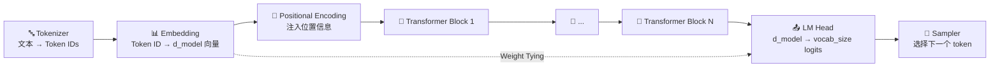

# Embedding

> **Source Reference:** Embedding module metadata (version definitions, dimensions,
> concept catalog, and experiment list) is maintained in `src/data/minimind/embedding-registry.ts`.
> This file is the canonical source; all consumers derive their data from it.

## Purpose

Embedding 层是 Transformer 的"语义入口"——将 Tokenizer 输出的离散 token ID 映射为连续的稠密向量（dense vector）。没有 Embedding 层，整数 token ID 对模型来说只是无意义的标签；有了 Embedding，每个 token 在 d_model 维空间中占据一个坐标，语义相近的词坐标相近。

在 MiniMind 中，Embedding 层本质上是一个可训练的查找表（Lookup Table）：`[vocab_size × d_model]` 的浮点矩阵，输入一个整数索引，输出对应的那一行向量。这一行向量就是该 token 的语义表示。

## Input

- Token ID 序列：`[batch_size, seq_len]`，由 Tokenizer 输出
- 词汇表大小：`vocab_size`（MiniMind 当前为 6400）
- 模型维度：`d_model`（MiniMind 当前为 512）

## Output

- Token Embeddings：`[batch_size, seq_len, d_model]` — 每个 token 被展开为 d_model 维稠密向量
- 该输出直接流入 Transformer 的第一个 Block（或先与 Positional Encoding 相加）

## Core Concepts

### 1. One-hot Encoding

**One-hot 是 Embedding 的"前身"——也是理解为什么需要 Embedding 的最佳起点。**

One-hot encoding 将每个 token 表示为一个长度为 vocab_size 的向量，其中只有该 token 对应索引的位置为 1，其余位置全为 0。例如 vocab_size=6400 时，token ID=42 的 one-hot 表示是一个 6400 维向量，第 42 位为 1。

One-hot 有两个致命问题：

1. **维度灾难**：vocab_size=6400 意味着每个 token 需要 6400 维表示，但几乎全是 0（稀疏）。如果将 128 个 token 组成一个序列，输入矩阵为 `[128, 6400]`，信息密度极低。

2. **无语义关系**：在 one-hot 空间中，任意两个不同 token 的向量都是正交的（内积 = 0）。"猫"和"狗"的距离与"猫"和"汽车"的距离完全相同——one-hot 无法表达相似性。

**Embedding 的解决方案**：将 one-hot 向量乘以一个 `[vocab_size, d_model]` 的矩阵。矩阵乘法 `one_hot @ W_embed` 等价于"查表"——取出 W_embed 中对应索引的那一行。这就是为什么实现上 Embedding 层直接做查表（O(1) 索引），而不是真的做稀疏矩阵乘法。

### 2. Embedding Matrix

**Embedding 矩阵 `W_embed` 的形状为 `[vocab_size, d_model]`，是整个模型中最直观的参数矩阵之一。**

```
         d_model (512)
         ─────────────→
vocab    0.12  -0.45   0.78  ...  0.33   ← token 0 的向量
_size    0.67   0.21  -0.09  ... -0.54   ← token 1 的向量
(6400)  -0.33   0.89   0.15  ...  0.72   ← token 2 的向量
  ↓      ...    ...    ...   ...  ...
         0.05  -0.67   0.44  ... -0.11   ← token 6399 的向量
```

- 每一行是一个 token 的语义向量（d_model 维）
- 行数等于词汇表大小（6400）
- 所有行共同构成语义空间

**参数量**：`vocab_size × d_model = 6400 × 512 = 3,276,800`。对 MiniMind 的 26M 总参数而言，Embedding 层占约 12.6%——这是必须认真对待的参数蛋糕。

**训练过程**：Embedding 矩阵在训练开始时随机初始化（通常用 N(0, 0.02) 或 Xavier uniform），然后在反向传播中通过梯度更新。训练结束后，语义相似的 token 的行向量会在空间中自然靠近。

### 3. Token ID Lookup

**Token ID Lookup 是 Embedding 层的前向传播——逻辑极其简单，但它是整个模型计算的第一步。**

```
输入: token_ids = [128, 456, 789]          # 3 个 token 的序列
              ↓
过程: W_embed[128]  → 向量 A (512维)       # 取第 128 行
      W_embed[456]  → 向量 B (512维)       # 取第 456 行
      W_embed[789]  → 向量 C (512维)       # 取第 789 行
              ↓
输出: [[A], [B], [C]]  形状: [3, 512]
```

在 PyTorch 中等价于 `nn.Embedding(vocab_size, d_model)` 的 `forward(input)`，底层调用 `F.embedding()`。计算复杂度 O(seq_len)，不涉及矩阵乘法——纯粹的内存索引操作。

关键细节：**Lookup 操作本身不可微**（索引是离散的），但 Embedding 矩阵的参数是可训练的——梯度通过查表结果直接流向被索引的那些行，其他行本步梯度为零。

### 4. Dense Vector

**Dense Vector（稠密向量）是相对于 one-hot（稀疏向量）的概念。** 一个 d_model=512 的稠密向量的每一位（dimension）都参与语义编码，没有一个维度是浪费的——这是与 one-hot 最本质的区别。

稠密向量的关键特性：

- **分布式表示（Distributed Representation）**：语义不是编码在"某一个维度"上，而是分布在所有维度的组合模式中。没有"猫维度"或"颜色维度"——"猫"由 512 个数值的整体模式定义。

- **语义压缩**：vocab_size=6400 个离散符号被压缩到 512 维连续空间中。512 维空间理论上可以表示远超 6400 个可区分的点——这意味着 Embedding 空间有充足的"语义容量"。

- **连续语义**：稠密向量空间是连续的，允许插值。"国王 - 男人 + 女人 ≈ 女王"这类类比推理正是基于稠密向量的线性运算。

### 5. Semantic Space

**Semantic Space（语义空间）是整个 Embedding 矩阵所张成的 d_model 维空间。** 训练完成后，这个空间呈现出明显的语义结构：

- **聚类**：语义相关的 token（如 "猫"、"狗"、"兔子"）的向量在空间中形成紧致的簇
- **方向**：空间中存在有意义的"语义方向"。例如从 "男人" 到 "女人" 的位移向量，加到 "国王" 上，接近 "女王"
- **距离**：余弦相似度（cosine similarity）衡量两个 token 的语义接近程度。值越接近 1，语义越相关

**可视化手段**：PCA / t-SNE 将 512 维向量降维到 2D，可以直观看到语义聚类。这是最受开发者欢迎的 Playground 实验之一。

**MiniMind 中的应用**：Embedding 层学到的语义空间直接影响下游所有层的计算——Attention 层的 QKV 投影在这个空间中操作，FFN 的变换在这个空间中执行。Embedding 空间的质量是模型整体性能的上限。

### 6. Weight Tying

**Weight Tying（权重绑定）是将输入 Embedding 矩阵与输出 LM Head 矩阵共享的技术。** Transformer 解码器的输入侧和输出侧都涉及 vocab_size 维度：

- **输入侧**：`W_embed: [vocab_size, d_model]` — token → 向量
- **输出侧**：`W_lm_head: [d_model, vocab_size]` — 向量 → logits（刚好是 W_embed 的转置）

如果没有 Weight Tying，这两个矩阵各自独立训练，参数量翻倍。将 `W_lm_head` 设为 `W_embed` 的转置：`W_lm_head = W_embed^T`，参数从 `2 × vocab_size × d_model` 降为 `vocab_size × d_model`。

**为什么有效**：如果两个 token 在 Embedding 空间中相近（语义相似），它们的 Embedding 向量也相近，那么在 LM Head 下它们对同一个 hidden state 的输出 logits 也应该相近。Weight Tying 自然地实现了这个约束——"语义相近的 token 应该有相近的输出得分"。

**MiniMind 中的应用**：是。LM Head 绑定到输入 Embedding 矩阵的转置，节省约 3.3M 参数。

**注意**：Weight Tying 假设输入语义空间和输出语义空间是同一空间。这个假设在实践中几乎总是成立的，但有些大型模型（如 GPT-3）选择不绑定以换取额外的建模灵活性。

### 7. MiniMind 中的 Embedding 位置

Embedding 层在 MiniMind 的完整数据流中处于 Tokenizer 之后、Transformer Blocks 之前的关键位置：



**上下游关系**：

- **上游**：Tokenizer 输出的 token ID 序列。词汇表大小（6400）必须与 Embedding 矩阵的行数精确匹配。如果 Tokenizer 和 Embedding 的词汇表不一致，token ID 将索引到错误的行或越界。

- **下游**：Positional Encoding（RoPE）。Embedding 输出的 d_model 维向量与位置编码向量相加，然后送入第一个 Transformer Block。这是为什么 Embedding 维度和位置编码维度都等于 d_model——它们需要相加。

- **与 LM Head 的关系**：如 Weight Tying 所述，LM Head 与 Embedding 共享权重（转置关系）。这意味着 Embedding 层同时承担"理解输入"和"选择输出"两项职责。

## Core Classes

| Class | File | Description |
|-------|------|-------------|
| `Embedding` | — | `nn.Embedding` 封装，token ID → d_model 稠密向量，带可训练权重 |
| `EmbeddingRegistry` | `src/data/minimind/embedding-registry.ts` | Embedding 模块元数据注册表 — 版本定义、维度配置、概念目录、实验清单 |

## Core Functions

| Function | Description |
|----------|-------------|
| `forward(token_ids: Tensor) -> Tensor` | 查表获取 token embeddings，输入 `[B, L]`，输出 `[B, L, d_model]` |
| `get_embedding_matrix() -> Tensor` | 返回完整的 `[vocab_size, d_model]` 权重矩阵（用于可视化、Weight Tying） |
| `weight_tying(lm_head: nn.Linear)` | 将 LM Head 的权重绑定为 Embedding 矩阵的转置 |

---

## Learning Notes

> **Embedding 的本质是"符号接地"（Symbol Grounding）**：将离散的、任意的符号（token ID）映射到连续的、有结构的意义空间。没有这一步，42 就只是 42——模型不知道它代表 "学习" 还是 "天气"。有了 Embedding，42 成为空间中一个有意义的点，这个点的坐标编码了它与其他所有 token 的关系。
>
> **为什么 Embedding 维度 d_model 通常取 2 的幂**：512、768、1024——不难发现这些数字都是 2 的幂。这不只是审美选择。GPU 的 CUDA Core 以 warp（32 线程）为单位调度计算，矩阵乘法在 Tensor Core 上以特定的 tile 大小执行（通常 16 或 32 的倍数）。512 是 16 和 32 的倍数，能充分利用硬件并行。选非对齐的值（如 500）会导致 padding 开销和浪费的计算。
>
> **Embedding 层在训练初期的行为**：随机初始化的 Embedding 矩阵像一个随机点的集合——没有语义结构。训练的前几千步中，Embedding 矩阵经历最剧烈的变化：高频 token 的行向量被大量梯度更新迅速拉向稳定区域，低频 token 则缓慢漂移。观察 Embedding 矩阵的范数变化曲线，可以判断学习率是否合适——范数爆炸通常意味着学习率太高。
>
> **Weight Tying 的小陷阱**：Weight Tying 在数学上优雅，但实现时有一个细节容易被忽视——LM Head 通常有 bias（`[vocab_size]`），而 Embedding 没有 bias。Weight Tying 只绑定 weight，bias 保持独立。另外，如果使用 Weight Tying，Embedding 矩阵的梯度会来自两个方向：输入侧的 Lookup 梯度和输出侧的 LM Head 梯度——这两部分梯度会叠加，所以 Embedding 的学习率敏感度与其他层不同。

## Questions

- [x] 为什么需要 Embedding 而非直接用 One-hot？→ One-hot 维度灾难 + 无法表达语义相似性；Embedding 提供稠密、低维、有语义结构的表示
- [x] Weight Tying 为什么有效？→ 语义相近的 token 在输入空间的接近自然意味着输出得分也接近；共享权重强制执行这个一致性
- [ ] d_model 的选择对模型容量和训练速度的量化影响？（需要在不同 d_model 下做 scaling 实验）
- [ ] 低频 token 的 Embedding 是否学得不够充分？如何验证并缓解？
- [ ] 中英文混合词汇表下的语义空间是否呈现语言分离现象？（中英文 token 各自成簇还是混合分布？）
- [ ] Embedding 矩阵的初始化策略（高斯 vs Xavier vs Kaiming）对收敛速度的影响？

## TODO

- [ ] 阅读 MiniMind Embedding 源码（`model/model_minimind.py` 中的 `Embedding` 类），添加逐行注释
- [ ] 编写单元测试：token ID lookup 正确性、输出形状验证
- [ ] 实验：PCA/t-SNE 可视化 6400 个 token 的语义聚类
- [ ] 实验：不同 d_model（256/512/768）下的语义空间结构对比
- [ ] 验证 Weight Tying 的参数节省量：对比 binding vs non-binding 的模型大小
