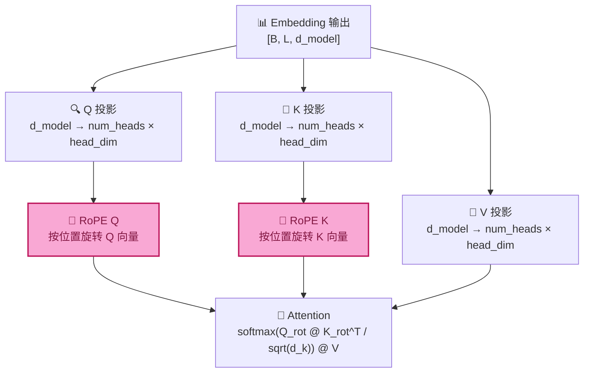

# RoPE（Rotary Position Embedding）

> **Source Reference:** RoPE module metadata (version definitions, frequency configs,
> concept catalog, and experiment list) is maintained in `src/data/minimind/rope-registry.ts`.
> This file is the canonical source; all consumers derive their data from it.

## Purpose

RoPE（Rotary Position Embedding，旋转位置编码）是当前主流 LLM（Llama、Qwen、Mistral、DeepSeek）采用的位置编码方案。它解决了一个根本问题：**Transformer 本身是位置盲的——它分不清 "A 在 B 前面" 和 "B 在 A 前面"**。RoPE 通过旋转矩阵将位置信息注入 token 表示，使得 Self-Attention 的内积天然包含**相对位置**信息。

在 MiniMind 中，RoPE 位于 Embedding 层之后、Attention 层之前——Embedding 输出的 d_model 维向量被 RoPE 按位置旋转，然后送入 Q/K 投影。RoPE 只作用于 Query 和 Key，不影响 Value。

## Input

- Query / Key 张量：`[batch_size, num_heads, seq_len, head_dim]`
- 位置索引：`[seq_len]`（每个 token 的位置 m = 0, 1, 2, ...）
- 旋转频率基数 θ（theta）：通常为 10000.0
- Head 维度 `head_dim`：必须为偶数（RoPE 在每两个维度上做 2D 旋转）

## Output

- 应用旋转后的 Query / Key 张量（同维度，位置信息已编码在内积中）
- 旋转后的 Q·K^T 仅依赖于相对位置差 (m - n)，而非绝对位置

## Core Concepts

### 1. 为什么 Transformer 需要位置编码

**Self-Attention 的计算是完全对称的——它对位置无感知。** 这是理解位置编码的起点。

考虑 Attention 的核心操作：对每个位置的 Query，与所有位置的 Key 计算内积（dot-product）。

```
Attention(Q, K, V) = softmax(Q @ K^T / sqrt(d_k)) @ V
```

注意这个公式：`Q @ K^T` 对序列中的所有位置一视同仁。如果你交换序列中两个 token 的位置，内积矩阵的行和列也跟着交换——Attention 输出也随之交换。这意味着：

- "猫 追 老鼠" 和 "老鼠 追 猫" 对未加位置编码的 Transformer 来说，Q·K 内积矩阵完全一样（只是行列重新排列），softmax 后的权重也一样——模型"看"不出主语和宾语的差别。
- 这是设计上的特性而非 bug：Transformer 的并行性正来自于"所有位置同时计算"。但这也意味着需要额外的机制让模型"知道"每个 token 在序列中的位置。

**解决方案**：在 token 进入 Attention 之前，向 token 的表示向量中注入位置信息。注入方式决定了位置编码的特性——绝对位置感知还是相对位置感知，可学习还是固定的。

### 2. Absolute Position Encoding（绝对位置编码）

**绝对位置编码是最直观的方案：为每个位置生成一个唯一向量，加到 token embedding 上。**

最早的 Transformer（"Attention Is All You Need", 2017）使用 **Sinusoidal Position Encoding**：

```
PE(pos, 2i)   = sin(pos / 10000^(2i/d_model))
PE(pos, 2i+1) = cos(pos / 10000^(2i/d_model))
```

其中 `pos` 是绝对位置（0, 1, 2, ...），`i` 是维度索引（0, 1, ..., d_model/2 - 1）。

**工作原理**：
- 每个位置 pos 被编码为一个 d_model 维向量
- 偶维度使用 sin，奇维度使用 cos
- 不同维度对应不同频率（波长从 2π 到 ~20000π）
- 最终：`token_representation = embedding(token) + PE(pos)`

**优点**：
- 无需训练参数
- 理论上可外推到训练时未见过的序列长度（sin/cos 自然延伸到更大的 pos）

**根本局限——只能编码绝对位置，无法自然地编码相对位置**：
- PE(pos1) 和 PE(pos2) 之间没有简单的线性关系来编码"pos2 在 pos1 之后 5 个位置"
- 模型必须通过训练数据"学会"从绝对位置推断相对关系——这是一种间接的、低效的学习方式
- 当推理时序列长度超过训练长度，模型遇到从未见过的绝对位置，性能可能下降

**可学习的绝对位置编码**（Learned Absolute Position Encoding，如 BERT、GPT-2）：
- 将 `PE(pos)` 替换为一个可训练的 `[max_seq_len, d_model]` 矩阵
- 每个位置的编码从数据中学习
- 同样的局限：绝对位置，外推能力更差（矩阵大小固定，无法处理超过 max_seq_len 的长度）

### 3. Relative Position Encoding（相对位置编码）

**相对位置编码的核心思想：模型不应该关心"第 5 个位置"，而应该关心"前面第 3 个位置"和"后面第 2 个位置"。**

在自然语言中，语义关系几乎总是相对的：
- 形容词修饰它后面的名词（相对关系）
- 代词指代它前面的实体（相对关系）
- 句法依赖是距离敏感的：相隔太远的两个词不太可能有直接依赖

**相对位置编码的直觉**：与其告诉模型 "token A 在第 7 位，token B 在第 12 位"，不如告诉它 "token B 在 token A 后面第 5 个位置"。

**早期方案（如 Transformer-XL、T5）**：
- 直接在 Attention 计算中注入相对位置偏置
- `A_ij = Q_i · K_j + Q_i · R_{j-i} + u · K_j + v · R_{j-i}`
- 其中 `R_{j-i}` 是相对位置 j-i 的可学习向量
- 复杂度增加，实现更繁琐

**RoPE 的优雅之处**：它不需要修改 Attention 公式本身——只需在 Q 和 K 进入 Attention 之前对它们做旋转。旋转后的内积 `(R_m·Q_m) · (R_n·K_n)` 自动变成 `Q_m^T · R_{n-m} · K_n`，仅依赖相对位置 (n-m)。这是 RoPE 最天才的设计。

### 4. RoPE 的数学思想

**RoPE 的核心思想来自复数乘法的几何意义：乘以 e^(iθ) 就是旋转角度 θ。**

#### 4.1 复数旋转

在复平面上，任意一个复数 z = a + bi 可以表示为 2D 平面上的点 (a, b)。将这个复数乘以 `e^(iθ) = cos(θ) + i·sin(θ)`：

```
z' = z · e^(iθ)
   = (a + bi) · (cos(θ) + i·sin(θ))
   = (a·cos(θ) - b·sin(θ)) + i·(a·sin(θ) + b·cos(θ))
```

写成 2D 旋转矩阵的形式：

```
[x']   [cos(θ)  -sin(θ)]   [x]
[y'] = [sin(θ)   cos(θ)] · [y]
```

**关键洞察**：旋转矩阵是正交矩阵。两个向量分别旋转后再做内积：

```
(R_θ·u)^T · (R_φ·v) = u^T · R_θ^T · R_φ · v
                     = u^T · R_{φ-θ} · v       （因为 R_θ^T · R_φ = R_{φ-θ}）
```

**结果仅依赖于旋转角度的差值 (φ - θ)**，而非各自的具体角度！这正是 RoPE 实现相对位置编码的数学基础。

#### 4.2 从复数旋转到高维旋转

RoPE 将一个 d 维向量（d 为偶数）拆分为 d/2 个二维子空间对：

```
对 (dim_0, dim_1)：在 2D 平面上旋转角度 θ_0
对 (dim_2, dim_3)：在 2D 平面上旋转角度 θ_1
...
对 (dim_{d-2}, dim_{d-1})：在 2D 平面上旋转角度 θ_{d/2 - 1}
```

每个 2D 子空间的旋转角度不同——这是 RoPE 能够编码丰富位置信息的关键。不同的"旋转速度"（频率）让模型能够同时捕捉短距离和长距离的位置关系。

#### 4.3 旋转角度与位置的关系

对于位置 m，第 i 个维度对的旋转角度为：

```
θ_i(m) = m · freq_i = m / theta^(2i/d)
```

其中：
- `m`：token 的绝对位置（0, 1, 2, ...）
- `theta`：旋转频率基数，通常为 10000.0
- `i`：维度对索引（0, 1, ..., d/2 - 1）
- `2i/d`：频率索引的归一化位置（从 0 到 ~1）

**直观理解**：
- 低维度对（i 小）：频率高（`theta^(2i/d)` 接近 1），对位置变化敏感——擅长捕捉短距离关系
- 高维度对（i 大）：频率低（`theta^(2i/d)` 接近 theta），对位置变化迟钝——擅长捕捉长距离关系

这就是 **Frequency Bands** 概念——RoPE 在不同维度对上使用不同的旋转速度，形成从"高频"到"低频"的频谱，同时覆盖短距离和长距离位置关系。

#### 4.4 数学总公式

对于位置 m，维度索引 i：

```
RoPE(x, m)_{2i}   = x_{2i} · cos(m·θ_i) - x_{2i+1} · sin(m·θ_i)
RoPE(x, m)_{2i+1} = x_{2i} · sin(m·θ_i) + x_{2i+1} · cos(m·θ_i)
```

其中 `θ_i = 1 / theta^(2i/d)`。

### 5. 二维旋转（2D Rotation）

**二维旋转是 RoPE 最底层的几何操作。** 每一个维度对 (2i, 2i+1) 上的旋转可以直观想象为：

```
旋转前                       旋转后
  y                            y
  │     ● (x, y)               │         ● (x', y')
  │    /                       │        /
  │   /                        │       /  ↙ 旋转了 θ
  │  /                         │      /
  │ / θ_original               │     / θ_original + m·freq_i
  └────────── x                └────────── x
```

旋转前后向量的长度不变（旋转是等距变换），改变的只是方向。这保证了 RoPE 不会放大或缩小向量范数，训练稳定性好。

**为什么是 2D 旋转而非 1D 缩放或更高维旋转？**

1. **2D 是最小的旋转单元**：在 1D 空间中没有"旋转"的概念（只能翻转符号），2D 是能做连续旋转的最低维度
2. **逐对独立旋转 = 块对角矩阵**：d/2 个 2×2 旋转矩阵沿对角线排列，整体仍是一个 d×d 的正交矩阵
3. **计算效率极高**：每个 2×2 块独立旋转，可以并行向量化计算，不需要构建稀疏的 d×d 旋转矩阵

### 6. Frequency Bands（频率带）

**Frequency Bands 是 RoPE 的"位置感知光谱"。**

RoPE 将 d 维向量拆分为 d/2 个 2D 平面，每个平面以不同的"速度"旋转：

```
维度对 0 (dim 0-1)：   freq = 1 / 10000^(0/512)    = 1.0000   ← 最快旋转
维度对 1 (dim 2-3)：   freq = 1 / 10000^(2/512)    = 0.9647
维度对 2 (dim 4-5)：   freq = 1 / 10000^(4/512)    = 0.9305
...
维度对 128 (dim 256-257)：freq = 1 / 10000^(256/512) = 0.0100
...
维度对 255 (dim 510-511)：freq = 1 / 10000^(510/512) = 0.0001  ← 最慢旋转
```

**频率带的工作机制**：

| 频率带 | 维度对 | 旋转速度 | 擅长捕捉 | 直观类比 |
|--------|--------|---------|---------|---------|
| **高频带** | 低维度对 | 快（每步转 ~1 弧度） | 相邻 token 的关系（距离 1-5） | "形容词修饰名词"这样的紧邻关系 |
| **中频带** | 中间维度对 | 中等 | 中等距离的关系（距离 10-50） | "代词指代"或"从句连接" |
| **低频带** | 高维度对 | 慢（每步转 ~0.0001 弧度） | 长距离关系（距离 100+） | "首尾呼应"这样的远距离结构 |

**为什么需要多个频率带？**

单一频率只能捕捉特定距离范围内的位置关系——高频对短距离敏感但长距离会"转晕"（旋转超过 2π，周期重复），低频对长距离有效但对短距离"几乎不动"（难以区分相邻位置）。多个频率带并行工作，确保 RoPE 对任意距离的位置关系都有良好的分辨力。

**theta 的选择意义**：

theta = 10000.0 是原始 RoPE 论文的默认选择。它定义了最低频率 = 1/10000 ≈ 0.0001。增大 theta 会降低最低频率（让低频带转得更慢），有利于更长的序列；减小 theta 则相反。NTK-Aware Scaling 等方法的核心就是调整 theta 来支持长文本外推。

### 7. MiniMind 中的 RoPE 作用

**RoPE 在 MiniMind 数据流中的位置：**



**RoPE 在 MiniMind 中的具体作用**：

1. **位置感知**：Embedding 层输出的 token 向量不包含任何位置信息——"猫"这个 token 在序列开头还是结尾，Embedding 层的输出完全一样。RoPE 为每个位置的向量赋予独特的方向偏转，让 Q 和 K 携带"我在哪里"的信息。

2. **相对位置传递**：两个位置 m 和 n 的旋转后 Q 和 K 做内积时，`(R_m·Q_m)^T · (R_n·K_n) = Q_m^T · R_{n-m} · K_n`。内积结果只依赖于相对距离 (n-m)，这意味着 Attention 自然地偏向于关注与当前位置有特定距离关系的 token——而非某个特定的绝对位置。

3. **只应用于 Q 和 K**：RoPE 不对 V（Value）做旋转，这是设计选择。旋转只影响"谁关注谁"（Q·K^T），而不影响"被关注后传递什么内容"（V）。位置信息决定注意力分布，语义信息决定被传递的内容——两种信息各司其职。

4. **与 Embedding 的衔接**：Embedding 输出的 d_model 维向量被拆分为 num_heads 个 head_dim 维向量。RoPE 在每个 head 的 head_dim 维度空间内独立旋转。注意：head_dim 必须为偶数——这是 RoPE 的硬性约束，因为每两个维度组成一个 2D 旋转对。

5. **对 Attention 计算的最终影响**：加了 RoPE 后，Attention 的 score 计算变为：

```
score_{m,n} = (R_m·Q_m)^T · (R_n·K_n) / sqrt(d_k)
            = Q_m^T · R_{n-m} · K_n / sqrt(d_k)
```

这表明 score 同时依赖于：(a) Q 和 K 的语义内容，(b) 它们的相对距离。当 n=m 时 `R_0 = I`（单位矩阵），退化为无位置偏置的标准 Attention——一个 token 最自然地关注自己。

---

## Core Classes

| Class | File | Description |
|-------|------|-------------|
| `RotaryEmbedding` | `src/lib/minimind/rope/RotaryEmbedding.ts` | RoPE 主类，预计算频率表并应用旋转变换 |
| `RoPERegistry` | `src/data/minimind/rope-registry.ts` | RoPE 模块元数据注册表 — 版本定义、频率配置、概念目录、实验清单 |

## Core Functions

| Function | Description |
|----------|-------------|
| `getFrequencies(headDim, theta)` | 计算各维度对的旋转频率：`freq_i = 1 / theta^(2i/d)` |
| `getAngles(positions, frequencies)` | 为每个位置 × 每个维度对计算旋转角度：`θ = pos · freq` |
| `rotateVector(x, cos, sin)` | 对单个向量执行 2D 逐对旋转：`x' = x⊙cos + rotate_half(x)⊙sin` |
| `applyRotation(x, angles)` | 完整的 RoPE 应用：将 d 维向量按 d/2 个 2D 子空间旋转 |
| `forward(query, key, positions)` | 一次调用完成 Q 和 K 的 RoPE 变换 |

---

## Learning Notes

> **RoPE 为什么比可学习的绝对位置编码更好？**
>
> 三个维度来理解：
>
> **泛化维度**：可学习的位置编码矩阵大小固定为 `[max_seq_len, d_model]`。如果训练时 max_seq_len=512，推理时遇到 513 个 token 的序列——模型不知道第 513 个位置的编码向量是什么。RoPE 的旋转角度 `m · freq` 中 m 可以任意大——它只是转更多的圈，数学上完全良定义。
>
> **效率维度**：可学习的位置编码需要一个 `[max_seq_len, d_model]` 的参数矩阵（以 2048×512 计 ≈ 1M 参数）。RoPE 是纯计算的——0 个可训练参数。这些参数可以用于更有价值的计算（FFN、Attention 投影）。
>
> **语义维度**：可学习的位置编码的每个位置向量是从数据中"背"下来的——位置 5 的编码和位置 10 的编码之间没有数学约束。RoPE 强制执行了一个几何结构：位置 m 的旋转是位置 1 的旋转的 m 次叠加——`R_m = (R_1)^m`。这种结构化先验比纯粹从数据中学习更高效。
>
> **为什么只对 Q 和 K 应用 RoPE，而不对 V？**
>
> Attention 的信息流可以分解为两步：(1) Q·K^T 决定注意力权重分布（"关注谁"），(2) 加权聚合 V 产生输出（"传递什么"）。RoPE 影响的是第一步——位置信息应该影响"谁关注谁"，而不是"被关注后传递什么语义内容"。如果对 V 也旋转，位置信息会"污染"语义内容——一个 token 的 Value 向量会因其绝对位置而改变，这种改变会传播到后续所有层。
>
> **RoPE 的复数视角**：如果你对复数表示感到舒适，RoPE 有一个更精简的描述——将每两个维度视为一个复数 `z = x_{2i} + i·x_{2i+1}`，乘以 `e^{i·m·freq}` 即可。旋转矩阵形式（cos/sin）和复数乘法形式在数学上完全等价。复数形式更紧凑，旋转矩阵形式在代码中实现更直接（大多数硬件/库不支持复数张量）。
>
> **theta=10000.0 的来历**：这个值来自原始 Sinusoidal Position Encoding 论文，被 RoPE 原封不动地继承。它定义了最低频率 = 1/10000 ≈ 0.0001。有趣的是，这个"魔法数字"在几乎所有的 RoPE 实现中都没有被改变——不是因为它是理论最优的（事实上 NTK 和 YaRN 都会调整它），而是因为"它足够好用"。改变 theta 属于长文本外推的优化范畴，而非核心 RoPE 的组成部分。

## Questions

- [x] RoPE 为什么比可学习的绝对位置编码更好？→ 零参数、外推能力、结构化几何先验
- [x] 为什么只对 Q 和 K 应用 RoPE，而不对 V 应用？→ 位置信息应影响注意力分布（Q·K），而非语义传递（V）
- [x] 旋转频率基数 theta 的选择有何影响？→ theta 决定最低频率；增大有利于长序列，减小有利于短序列
- [ ] RoPE 如何实现长文本外推（NTK-Aware Scaling、YaRN）？（超出当前阶段范围，留给后续实验）
- [ ] 不同 theta 值下，各频率带的实际行为差异量化实验？
- [ ] RoPE 在 mini-batch 训练和单条推理时的实际计算开销对比？

## TODO

- [x] 创建 RoPE 理论文档（本文档）
- [ ] 阅读 MiniMind RoPE 源码（`model/model_minimind.py` 中的 `precompute_freqs_cis` 和 `apply_rotary_emb`），添加逐行注释
- [ ] 编写单元测试：旋转前后向量范数不变（等距性验证）
- [ ] 编写单元测试：旋转角度差值与内积关系验证
- [ ] 实验：可视化不同位置的 Q/K 旋转（2D 投影）
- [ ] 实验：对比不同 theta 值（1000 / 10000 / 100000）下的长距离注意力衰减模式
- [ ] 实验：高频带 vs 低频带的相邻位置区分度量化
