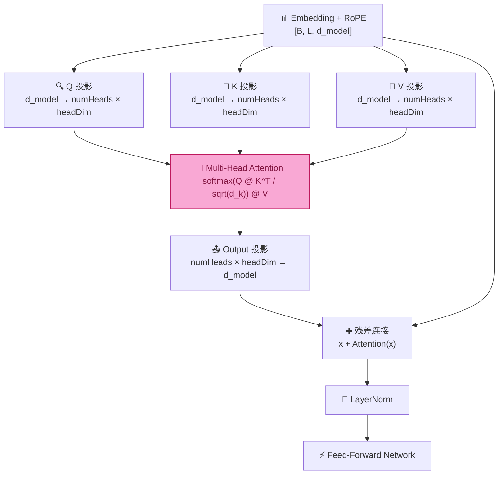

# Attention（Self-Attention / Multi-Head Attention）

> **Source Reference:** Attention module metadata (version definitions, dimension configs,
> concept catalog, and experiment list) is maintained in `src/data/minimind/attention-registry.ts`.
> This file is the canonical source; all consumers derive their data from it.

## Purpose

Self-Attention 是 Transformer 的核心计算引擎。它解决了一个 RNN/LSTM 无法有效处理的问题：**如何让序列中相距遥远的两个 token 直接交互，而不经过中间 token 的逐层传递**。RNN 需要 O(L) 步才能让位置 0 的信息到达位置 L；Self-Attention 通过 O(L²) 的内积矩阵，让每一对 token 在 O(1) 路径长度内直接通信。

在 MiniMind 中，Attention 位于 RoPE 之后、FFN 之前——RoPE 旋转后的 Q/K 向量进入 Attention，计算加权聚合，输出送入残差连接和 LayerNorm，然后进入 FFN。

## Input

- Query 矩阵：`[seqLen, headDim]`（单头）或 `[numHeads, seqLen, headDim]`（多头）
- Key 矩阵：同上形状
- Value 矩阵：同上形状
- 可选：Causal Mask（解码器自回归生成时使用）

## Output

- Attended 输出：与 Query 同形状
- Attention Weights 矩阵：`[seqLen, seqLen]`（单头）或 `[numHeads, seqLen, seqLen]`（多头）
- Attention Trace：包含 scores、weights、head outputs 的完整记录

## Core Concepts

### 1. 为什么需要 Self-Attention

**RNN 的根本局限——信息瓶颈。**

在 RNN/LSTM 中，位置 0 的信息要到达位置 L，必须经过 L 次隐藏状态传递。每一步传递都是一次"信息压缩"——隐藏状态向量 h_t 必须同时编码"当前 token 的语义"和"之前所有 token 的摘要"。随着序列变长，早期信息被逐步稀释：

```
RNN 信息流（线性瓶颈）：
h_0 → h_1 → h_2 → ... → h_L
 ↑      ↑      ↑          ↑
t_0    t_1    t_2        t_L

要让 t_0 影响 t_L 的输出：t_0 → h_0 → h_1 → h_2 → ... → h_L → output_L
                          └─── L 步传递，每步有信息损失 ───┘
```

**Self-Attention 的解决方案——全连接信息流。**

Self-Attention 计算所有 token 对之间的直接交互。位置 i 的输出是**所有位置**的 Value 向量的加权和，权重由 Query_i 和 Key_j 的相似度决定：

```
Self-Attention 信息流（全连接）：
t_0 ←──→ t_1
 ↕         ↕
t_2 ←──→ t_3

每个 token 直接关注所有其他 token。
t_0 影响 t_L 的输出：只需一步——t_L 的 Query 与 t_0 的 Key 计算内积。
                    └─── O(1) 路径长度 ───┘
```

**为什么这很重要？**

自然语言中充满长距离依赖：
- 代词指代："**张三** 昨天去了超市，**他** 买了一些水果"——"他"需要关注 6 个 token 之前的"张三"
- 从句嵌套："**那个 昨天 在 公园里 散步 的 人** 是 我的 朋友"——"人"需要关注 7 个 token 之前的"那个"
- 远距离约束："**虽然** 天气 预报 说 今天 会 下雨，**但是** 阳光 一直 很 好"——"但是"需要关注 10 个 token 之前的"虽然"

### 2. Q/K/V 的含义

**Q/K/V 是 Self-Attention 最核心的三个角色。** 理解它们的最佳方式是类比信息检索：

| 角色 | 全称 | 信息检索类比 | 在 Attention 中的作用 | 来源 |
|------|------|-------------|---------------------|------|
| **Q** (Query) | 查询向量 | 搜索关键词 | "我在找什么？"——当前 token 想要关注什么类型的信息 | 当前 token 的表示 |
| **K** (Key) | 键向量 | 文档索引 | "我是什么？"——每个 token 的"标签"，用于与 Query 匹配 | 每个 token 的表示 |
| **V** (Value) | 值向量 | 文档内容 | "我有什么？"——每个 token 携带的实际信息，被加权聚合 | 每个 token 的表示 |

**Q/K/V 都来自同一个输入序列——这就是"Self"-Attention 的含义：序列自己关注自己。**

```
输入: X = [x_0, x_1, x_2]  (seqLen=3 个 token 的表示向量)

投影:
  Q = X @ W_Q    # "每个 token 想问什么"
  K = X @ W_K    # "每个 token 的标签是什么"
  V = X @ W_V    # "每个 token 有什么内容"

Attention 计算:
  scores   = Q @ K^T           # "我的问题 和 你的标签 匹配吗？"
  weights  = softmax(scores)   # "匹配度 → 关注比例"
  output   = weights @ V       # "按比例聚合所有 token 的内容"
```

**直观例子——句子 "The cat sat on the mat"：**

当计算 "sat" 这个 token 的输出时：
- "sat" 的 **Query**："我需要找到主语（谁在做动作）和状语（在哪里）"
- "cat" 的 **Key**："我是名词，可能是主语" → 与 Query 高匹配 → 高 attention weight
- "mat" 的 **Key**："我是名词，可能是地点" → 中等匹配 → 中等 attention weight
- "The" 的 **Key**："我是冠词" → 低匹配 → 低 attention weight

最终 "sat" 的输出 ≈ 0.6 × V_cat + 0.3 × V_mat + 0.1 × V_The + ...

### 3. Scaled Dot-Product Attention

**这是所有 Attention 变体的计算核心。**

```
Attention(Q, K, V) = softmax(Q @ K^T / sqrt(d_k)) @ V
```

**逐步拆解：**

**Step 1 — 计算内积分数（Raw Scores）：**

```
S = Q @ K^T
```

对于位置 i（Query）和位置 j（Key），`S[i][j] = Q_i · K_j`（向量内积）。内积衡量两个向量的"相似度"——方向越一致，内积越大。

**Step 2 — 缩放（Scale）：**

```
S_scaled = S / sqrt(d_k)
```

**这是 Attention 最关键的细节之一——为什么要除以 sqrt(d_k)？**

当 d_k 很大时（如 64 或 128），Q 和 K 的内积是 d_k 个独立随机变量的和。假设 Q 和 K 的每个分量独立且方差为 1，则 Q·K 的方差 = d_k。d_k=64 时，内积的典型值范围约为 ±8（标准差 = sqrt(64) = 8）。这么大的值进入 softmax 后，梯度趋近于 0（softmax 饱和区），训练无法进行。

除以 sqrt(d_k) 将方差归一化为 1，使内积值落在 softmax 的"敏感区"（大约 [-3, 3]），梯度流畅。

**Step 3 — Softmax：**

```
W = softmax(S_scaled)     # 沿 Key 维度（每一行）
```

Softmax 将缩放的分数转换为概率分布：每个 Query 对所有 Key 的 attention weights 之和为 1。公式：

```
W[i][j] = exp(S_scaled[i][j]) / Σ_k exp(S_scaled[i][k])
```

**数值稳定的 Softmax 实现**：先减去每行的最大值（softmax(x) = softmax(x - max(x))），防止 exp 溢出：

```
softmax_stable(x_i) = exp(x_i - max(x)) / Σ_j exp(x_j - max(x))
```

**Step 4 — 加权聚合：**

```
output = W @ V
```

每个位置的输出是所有 Value 向量的加权组合，权重表示"该位置对我有多重要"。

### 4. Softmax 在 Attention 中的角色

**Softmax 将"匹配度"转化为"关注分布"。**

- **归一化**：每行权重之和 = 1，保证输出量级不会因序列长度变化而爆炸
- **竞争性**：Softmax 是 winner-take-most 的——大分数获得不成比例的高权重。如果 token A 的分数比 token B 高 2，softmax 后 A 的权重是 B 的 e² ≈ 7.4 倍
- **可微性**：梯度处处存在且平滑，支持反向传播训练
- **温度效应**：如果引入温度参数 τ：`softmax(x / τ)`，τ 越小分布越尖锐（更聚焦），τ 越大分布越均匀（更分散）

### 5. Causal Mask

**Causal Mask（因果掩码）确保自回归生成时，token 只能关注当前位置及之前的 token，不能"偷看"未来。**

在训练时，虽然我们看到完整序列，但模型必须学会只依赖已生成的前缀来预测下一个 token——这是自回归语言模型的核心约束。

**实现方式**：在 softmax 之前，将未来位置的分数设为 -∞（代码中用 -1e9 或 -Infinity）：

```
Causal Mask 矩阵（seqLen=4）：
     K0   K1   K2   K3
Q0 [  0  -∞   -∞   -∞  ]    ← Q0 只能看到 K0（自己）
Q1 [  0   0   -∞   -∞  ]    ← Q1 只能看到 K0, K1
Q2 [  0   0    0   -∞  ]    ← Q2 只能看到 K0, K1, K2
Q3 [  0   0    0    0  ]    ← Q3 可以看到所有

exp(-∞) = 0 → softmax 后未来位置的权重为 0
```

**如果不用 Causal Mask 会怎样？**

训练时的 Loss 会极低（模型"作弊"直接看答案），但推理时模型无法生成——因为推理时未来 token 还不存在，模型从未学过在"看不见未来"的条件下做预测。

### 6. Multi-Head Attention

**单头的局限**：一个 token 只能有一种"关注模式"。但自然语言中，一个词同时参与多种关系——"cat"既是"sat"的主语，又可能受"the"的修饰。

**Multi-Head Attention 的解决方案**：并行运行多个独立的 Attention，每个 head 在不同的表示子空间中学习不同类型的依赖关系。

```
MultiHead(Q, K, V) = Concat(head_0, head_1, ..., head_{h-1}) @ W_O

其中:
  head_i = Attention(Q @ W_Q^i, K @ W_K^i, V @ W_V^i)
```

**分头与合并**：

```
输入: [seqLen, d_model]        d_model = 512, numHeads = 8

分头:
  [seqLen, 512] → reshape → [seqLen, 8, 64] → transpose → [8, seqLen, 64]
                                                              ↑ numHeads
                                                                 ↑ headDim = d_model / numHeads

每头独立 Attention:
  head_0: [seqLen, 64] → Attention → [seqLen, 64]
  head_1: [seqLen, 64] → Attention → [seqLen, 64]
  ...
  head_7: [seqLen, 64] → Attention → [seqLen, 64]

合并:
  [8, seqLen, 64] → transpose → [seqLen, 8, 64] → reshape → [seqLen, 512]
```

**为什么多头有效？**

- **表示子空间**：不同的 head 学习不同的注意力模式——head 0 可能专注于相邻 token 的句法依赖，head 3 可能专注于远距离的语义关系，head 7 可能专注于 [BOS]/[EOS] 等特殊 token。
- **集成学习**：多个 head 相当于多个专家并行工作，最后通过 W_O 融合各方意见。这比用一个大的单头更有效。
- **可解释性**：每个 head 的 attention weights 可以独立可视化，帮助理解模型"在看什么"。

### 7. Attention Matrix

**Attention Matrix（注意力矩阵）是理解模型行为的核心可视化工具。**

它是一个 `[seqLen, seqLen]` 矩阵，其中 `A[i][j]` 表示位置 i 对位置 j 的关注权重（softmax 后的值）。

**典型模式：**

| 模式 | 矩阵特征 | 语义含义 |
|------|---------|---------|
| **对角线** | 对角线附近权重高 | 局部依赖（相邻词关系） |
| **垂直线** | 某列的权重普遍高 | 某个 token 被广泛关注（如 [BOS]、标点） |
| **水平线** | 某行的权重分布均匀 | 该 token 均匀关注所有人（如 [EOS]） |
| **块状** | 矩阵呈分块结构 | 句子边界 / 从句分割 |
| **首列高亮** | 第一列权重偏高 | 所有 token 都关注序列起始 |

**Head Diversity（头多样性）**：不同 head 的 attention matrix 应有不同的模式。如果多个 head 的矩阵高度相似，说明它们没有学到互补的注意力模式——这是模型容量利用不足的信号。

### 8. MiniMind 中 Attention 的位置

**Attention 在 MiniMind 数据流中的位置：**



**在 MiniMind Decoder Block 中：**

```
DecoderBlock(x):
  # 1. Pre-Norm Attention
  attn_input = LayerNorm(x)
  attn_output = MultiHeadAttention(attn_input)   # ← Attention 在这里
  x = x + attn_output                             # 残差连接

  # 2. Pre-Norm FFN
  ffn_input = LayerNorm(x)
  ffn_output = FFN(ffn_input)
  x = x + ffn_output                              # 残差连接

  return x
```

---

## Core Classes

| Class | File | Description |
|-------|------|-------------|
| `MiniAttention` | `src/lib/minimind/attention/Attention.ts` | Multi-Head Attention 主类，封装 QKV 投影、分头/合并、Scaled Dot-Product Attention |
| `AttentionRegistry` | `src/data/minimind/attention-registry.ts` | Attention 模块元数据注册表 — 版本定义、概念目录、实验清单 |

## Core Functions

| Function | Description |
|----------|-------------|
| `dotProduct(a, b)` | 向量内积：Σ a_i × b_i |
| `matrixMultiply(A, B)` | 矩阵乘法：C[i][j] = Σ A[i][k] × B[k][j] |
| `softmax(vector)` | 数值稳定 softmax：exp(x - max(x)) / Σ exp(x - max(x)) |
| `applyCausalMask(scores)` | 将上三角（未来位置）设为 -Infinity |
| `scaledDotProductAttention(Q, K, V, mask?)` | Attention 核心计算：softmax(QK^T/√d_k)V |
| `forward(input)` | MiniAttention 完整前向传播入口 |
| `computeScores(Q, K)` | 计算原始 attention scores（缩放前） |
| `getAttentionTrace()` | 获取最近一次 forward 的完整 trace |

---

## Learning Notes

> **为什么 Self-Attention 是 O(L²) 而不是 O(L)？**
>
> Attention 计算 Q @ K^T 产生一个 [L, L] 的矩阵，每个元素都是两个向量的内积（O(d_k)）。总复杂度 = O(L² · d_k)。这是 Attention 的根本计算特征——它有意让每对 token 都直接交互，代价是平方级别的计算。对于短序列（L < 512），O(L²) 完全可承受；对于长序列（L > 4096），这是瓶颈——Flash Attention、Sparse Attention、Linear Attention 等变体都是为了降低这个 O(L²)。
>
> **为什么除以 √d_k 而不是 d_k 或其他值？**
>
> 假设 Q 和 K 的分量独立同分布，均值为 0，方差为 1。则 Q·K = Σ q_i × k_i，方差 = Σ Var(q_i × k_i) = Σ Var(q_i) × Var(k_i) = d_k × 1 × 1 = d_k。要让方差回到 1，需要除以 std = √d_k。除以 d_k（而非 √d_k）会把方差压到 1/d_k，内积值太小，softmax 趋于均匀分布，注意力失去选择性。这背后的假设是 Q 和 K 近似独立——在初始化的随机权重下成立；训练后 LayerNorm 和权重缩放帮助维持这一性质。
>
> **Causal Mask 和 Padding Mask 的区别？**
>
> - **Causal Mask**：防止关注未来 token（自回归约束）。形状是上三角 mask，对所有序列都一样。
> - **Padding Mask**：防止关注 padding token（批量训练约束）。不同序列长度不同，pad 到相同长度后，pad 位置的 attention 应被屏蔽。
> - 两者可以组合：`final_mask = causal_mask | padding_mask`。
>
> **MiniMind 的 Attention 参数规模：**
>
> d_model=512, num_heads=8, head_dim=64：
> - W_Q: 512 × 512 = 262,144
> - W_K: 512 × 512 = 262,144
> - W_V: 512 × 512 = 262,144
> - W_O: 512 × 512 = 262,144
> - Attention 总参数 = 1,048,576（约 1M，占 MiniMind 26M 的 ~4%）
>
> 相比之下，FFN 的参数多得多（~17M），占模型的 ~65%。Attention 虽然"名声在外"，但并不是参数最密集的部分——它的价值在于计算结构（全连接交互），而非参数规模。

## Questions

- [x] 为什么需要除以 √d_k 进行缩放？→ 将 Q·K 内积的方差从 d_k 归一化到 1，防止 softmax 饱和
- [x] Self-Attention 为什么比 RNN 更好？→ O(1) 路径长度 vs O(L)，每对 token 直接交互
- [x] Causal Mask 的作用是什么？→ 保证自回归生成时不能"偷看"未来 token
- [x] 多头注意力的意义是什么？→ 多个表示子空间并行，学习不同类型的依赖关系
- [ ] 注意力头数 (num_heads) 如何影响模型的行为？（超出当前阶段范围，留给后续实验）
- [ ] KV Cache 如何在推理时加速 attention 计算？
- [ ] 为什么推理时使用 GQA（Grouped Query Attention）可以减小 KV Cache？
- [ ] Flash Attention 如何在不改变计算结果的前提下降低显存和加速？

## TODO

- [x] 创建 Attention 理论文档（本文档）
- [x] 创建 Attention SSOT Registry
- [x] 实现 MiniAttention 核心类（V1: Basic Attention + Multi-Head）
- [ ] 阅读 MiniMind Attention 源码，添加逐行注释
- [ ] 编写单元测试：softmax 数值稳定性（极大值输入不溢出）
- [ ] 编写单元测试：Causal Mask 正确性（未来位置权重为 0）
- [ ] 编写单元测试：Multi-Head 输出形状验证
- [ ] 实验：可视化不同 head 的 attention weights 热力图
- [ ] 实验：对比不同 num_heads（1/2/4/8）下的注意力模式
- [ ] 实验：验证 Causal Mask 对未来位置的屏蔽效果
