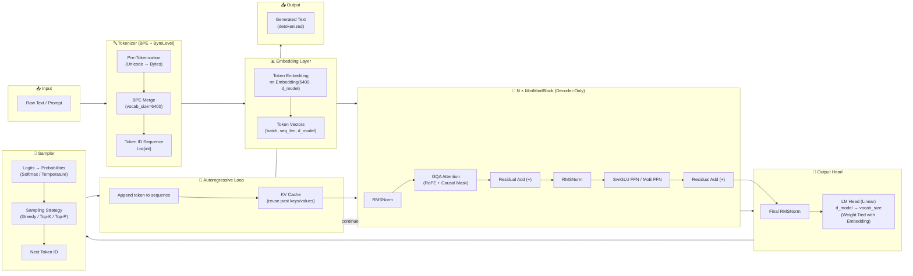
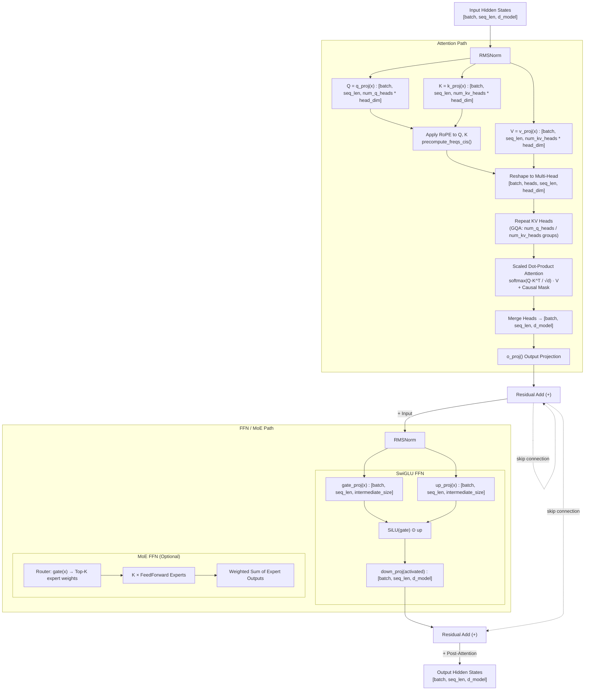
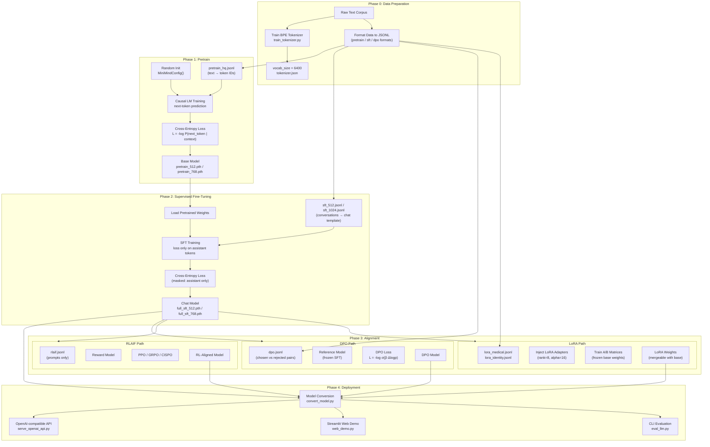
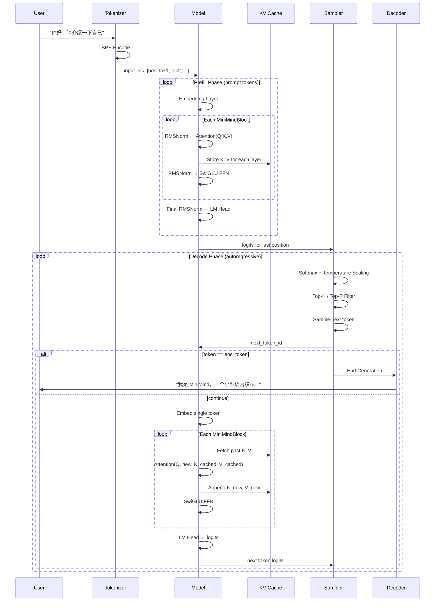
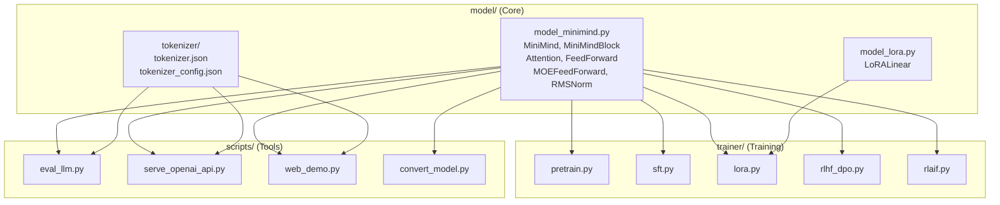
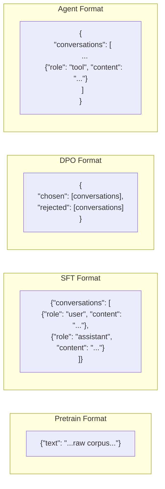

# MiniMind Global Data Flow

> **Mermaid 架构图集** — 覆盖从 Raw Text 到 Inference 的完整数据流，以及训练管线的全生命周期。

---

## 1. Overall Pipeline: Raw Text → Inference

---

## 2. MiniMindBlock Internal Data Flow

---

## 3. Training Pipeline: End-to-End Lifecycle

---

## 4. Autoregressive Inference Loop (with KV Cache)

---

## 5. File Dependency Map

---

## 6. Data Format Specifications

---

> **Note:** All diagrams follow the actual MiniMind architecture as implemented in [jingyaogong/minimind](https://github.com/jingyaogong/minimind). These are documentation artifacts for the learning project — no implementations are included.
